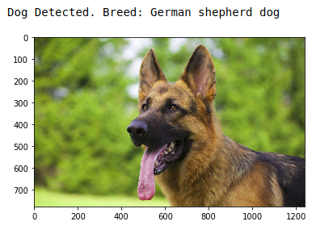

# Dog Breed Classification using Pytorch - Part 1
## Creating model from Scratch

### Introduction

In this post, we will create an Image classification model using PyTorch with the goal of Recognizing Breed of Dogs from images. For this project, we will create the model from scratch. We will look into Transfer Learning based models in future posts. 

The image below displays potential sample output of the finished project.



There are a total of 133 Dog-Breeds (classes) in the source data. So, a random guess will provide a correct answer roughly 1 in 133 times, which corresponds to an accuracy of less than 1%. 

Dog Breed Classification is an exceptionally difficult problem because:

Different dog breeds can look similar.

Brittany | Welsh Springer Spaniel
- | - 
 | 

And same dog breed can have different looking dogs.

Yellow Labrador | Chocolate Labrador | Black Labrador
- | -
 |  | 

The model will have to account for all of these factors to produce a high accuracy.

Let's get started.

### Import Libraries


```python
import numpy as np
from glob import glob
import os

import torch
import torch.nn as nn
import torch.optim as optim
from torchvision import datasets, transforms
from torch.utils.data import DataLoader

from PIL import Image
from PIL import ImageFile
ImageFile.LOAD_TRUNCATED_IMAGES = True
```

### Check Datasets

The first step is to load-in the Images and check the total size of our dataset.

> The Dog Images Dataset can be downloaded from here: [dog dataset](https://s3-us-west-1.amazonaws.com/udacity-aind/dog-project/dogImages.zip). Unzip the folder and place it in this project's home directory, at the location `/dogImages`. 


```python
# load filenames for dog images
dog_files = np.array(glob(os.path.join('dogImages','*','*','*')))

# print number of images in dataset
print('There are %d total dog images.' % len(dog_files))
```

    There are 8351 total dog images.


### Check CUDA Availability

Check if GPU is available.


```python
# check if CUDA is available
use_cuda = torch.cuda.is_available()
```

### Define Parameters

Define the parameters needed in data loader and model creation.


```python
# parameters
n_epochs = 20
num_classes = 133
num_workers = 0
batch_size = 10
learning_rate = 0.05
```

### Data Loaders for the Dog Dataset

In the next step we will do the following:
1. Define Transformations that will be applied to the images using `torchvision.transforms`. Transformations are also known as Augmentation. This is a pre-processing step and it helps the model to generalize to new data much better.
2. Load the image data using `torchvision.datasets.ImageFolder` and apply the transformations.
3. Create Dataloaders using `torch.utils.data.DataLoader`.  

> **Note:**
- We have created dictionaries for all three steps that are divided into train, validation and test sets.
- The Image Resize shape and mean & standard-deviation values for Normalization module were chosen so as to replicate the VGG16 model.


```python
## Data loaders for training, validation, and test sets
trans = {
    'train': transforms.Compose([
        transforms.RandomResizedCrop(224),
        transforms.RandomHorizontalFlip(),
        transforms.RandomRotation(15),
        transforms.ToTensor(),
        transforms.Normalize(mean=[0.485, 0.456, 0.406],
                             std=[0.229, 0.224, 0.225])
    ]),
    'valid': transforms.Compose([
        transforms.Resize(224),
        transforms.CenterCrop(224),
        transforms.ToTensor(),
        transforms.Normalize(mean=[0.485, 0.456, 0.406],
                             std=[0.229, 0.224, 0.225])
    ]),
    'test': transforms.Compose([
        transforms.Resize(224),
        transforms.CenterCrop(224),
        transforms.ToTensor(),
        transforms.Normalize(mean=[0.485, 0.456, 0.406],
                             std=[0.229, 0.224, 0.225])
    ])
}

data = {
    'train': datasets.ImageFolder(os.path.join('dogImages','train'), transform=trans['train']),
    'valid': datasets.ImageFolder(os.path.join('dogImages','valid'), transform=trans['valid']),
    'test': datasets.ImageFolder(os.path.join('dogImages','test'), transform=trans['test'])
}

loaders_scratch = {
    'train': DataLoader(data['train'], batch_size=batch_size, num_workers=num_workers, shuffle=True),
    'valid': DataLoader(data['valid'], batch_size=batch_size, num_workers=num_workers, shuffle=True),
    'test': DataLoader(data['test'], batch_size=batch_size, num_workers=num_workers, shuffle=True)
}
```


```python
print(f"Size of Train DataLoader: {len(loaders_scratch['train'].dataset)}")
print(f"Size of Validation DataLoader: {len(loaders_scratch['valid'].dataset)}")
print(f"Size of Test DataLoader: {len(loaders_scratch['test'].dataset)}")
```

    Size of Train DataLoader: 6680
    Size of Validation DataLoader: 835
    Size of Test DataLoader: 836


### Model Architecture

Next, we will define a class `Net` which will create our model architecture. The configuration used here is a simplified (smaller) version of VGG16 model.

After defining the architecture we instantiate the class and move the model to GPU (if available).


```python
# cfg = [64, 64, 'M', 128, 128, 'M', 256, 256, 256, 'M', 512, 512, 512, 'M', 512, 512, 512, 'M']
# The above configuration is the complete VGG16 model configuration. We will use a smaller version of this.

cfg = [8, 'M', 16, 'M', 32, 'M', 64, 'M', 128, 'M']

# define the CNN architecture
class Net(nn.Module):

    def __init__(self, model_cfg=cfg):
        super(Net, self).__init__()
        ## Define layers of a CNN
        self.features = self.make_layers(model_cfg)
        self.classifier = nn.Sequential(
            nn.Linear(128 * 7 * 7, 4096),
            nn.ReLU(inplace=True),
            nn.Dropout(p=0.5),
            nn.Linear(4096, 1024),
            nn.ReLU(inplace=True),
            nn.Dropout(p=0.5),
            nn.Linear(1024, num_classes)
        )
    
    def forward(self, x):
        ## Define forward behavior
        x = self.features(x)
        x = x.view(x.size(0), -1)
        x = self.classifier(x)
        return x
    
    def make_layers(self, model_cfg):
        layers = []
        in_channels = 3
        for l in model_cfg:
            if l == 'M':
                layers.extend([nn.MaxPool2d(kernel_size=2, stride=2)])
            else:
                layers.extend([
                    nn.Conv2d(in_channels, l, kernel_size=3, padding=1),
                    nn.BatchNorm2d(l),
                    nn.ReLU(inplace=True)
                ])
                in_channels = l
                
        # layers.extend([nn.AvgPool2d(kernel_size=1, stride=1)])
        
        return nn.Sequential(*layers)


# instantiate the CNN
model_scratch = Net(cfg)

# move tensors to GPU if CUDA is available
if use_cuda:
    model_scratch.cuda()
```

### Specify Loss Function and Optimizer

We have chosen `CrossEntropyLoss` as our loss function and `Stochastic Gradient Descent` as our optimizer.


```python
## select loss function
criterion_scratch = nn.CrossEntropyLoss()

## select optimizer
optimizer_scratch = optim.SGD(params=model_scratch.parameters(), lr=learning_rate)
```

### Train and Validate the Model

We define a function for Training and Validation. It calculates a running train & validation loss and saves the model whenever the validation loss decreases.


```python
def train(n_epochs, loaders, model, optimizer, criterion, use_cuda, save_path):
    """returns trained model"""
    # initialize tracker for minimum validation loss
    valid_loss_min = np.Inf 
    
    for epoch in range(1, n_epochs+1):
        # initialize variables to monitor training and validation loss
        train_loss = 0.0
        valid_loss = 0.0
        
        ###################
        # train the model #
        ###################
        for batch_idx, (data, target) in enumerate(loaders['train']):
            # move to GPU
            if use_cuda:
                data, target = data.cuda(), target.cuda()
            ## find the loss and update the model parameters accordingly
            ## record the average training loss
            
            optimizer.zero_grad()
            output = model(data)
            loss = criterion(output, target)
            loss.backward()
            optimizer.step()
            
            train_loss += loss.item() * data.size(0)
            
            if batch_idx % 200 == 0:
                print(f"Training Batch: {batch_idx}+/{len(loaders['train'])}")
            
        ######################    
        # validate the model #
        ######################
        for batch_idx, (data, target) in enumerate(loaders['valid']):
            # move to GPU
            if use_cuda:
                data, target = data.cuda(), target.cuda()
            ## update the average validation loss
            
            output = model(data)
            loss = criterion(output, target)
            
            valid_loss += loss.item() * data.size(0)
            
            if batch_idx % 200 == 0:
                print(f"Validation Batch: {batch_idx}+/{len(loaders['valid'])}")

        
        train_loss = train_loss / len(loaders['train'].dataset)
        valid_loss = valid_loss / len(loaders['valid'].dataset)
        
        # print training/validation statistics 
        print(f'Epoch: {epoch} \tTraining Loss: {train_loss} \tValidation Loss: {valid_loss}')
        
        # save the model if validation loss has decreased
        if valid_loss <= valid_loss_min:
            print(f'Validation loss decreased from {valid_loss_min} to {valid_loss}.\nSaving Model...')
            torch.save(model.state_dict(), save_path)
            valid_loss_min = valid_loss
            
    # return trained model
    return model
```

Finally, we train the actual model.


```python
# train the model
if use_cuda:
    model_scratch = model_scratch.cuda()

model_scratch = train(n_epochs, loaders_scratch, model_scratch, optimizer_scratch, 
                      criterion_scratch, use_cuda, 'model_scratch.pt')
```

    Training Batch: 0+/668
    Training Batch: 200+/668
    Training Batch: 400+/668
    Training Batch: 600+/668
    Validation Batch: 0+/84
    Epoch: 1 	Training Loss: 4.850923725944793 	Validation Loss: 4.672233612951405
    Validation loss decreased from inf to 4.672233612951405.
    Saving Model...
    Training Batch: 0+/668
    Training Batch: 200+/668
    Training Batch: 400+/668
    Training Batch: 600+/668
    Validation Batch: 0+/84
    Epoch: 2 	Training Loss: 4.692525517797756 	Validation Loss: 4.575351500939466
    Validation loss decreased from 4.672233612951405 to 4.575351500939466.
    Saving Model...
    Training Batch: 0+/668
    Training Batch: 200+/668
    Training Batch: 400+/668
    Training Batch: 600+/668
    Validation Batch: 0+/84
    Epoch: 3 	Training Loss: 4.611959935662275 	Validation Loss: 4.490825558850865
    Validation loss decreased from 4.575351500939466 to 4.490825558850865.
    Saving Model...
    Training Batch: 0+/668
    Training Batch: 200+/668
    Training Batch: 400+/668
    Training Batch: 600+/668
    Validation Batch: 0+/84
    Epoch: 4 	Training Loss: 4.54853381939277 	Validation Loss: 4.377603702202529
    Validation loss decreased from 4.490825558850865 to 4.377603702202529.
    Saving Model...
    Training Batch: 0+/668
    Training Batch: 200+/668
    Training Batch: 400+/668
    Training Batch: 600+/668
    Validation Batch: 0+/84
    Epoch: 5 	Training Loss: 4.480644456640689 	Validation Loss: 4.364550402064523
    Validation loss decreased from 4.377603702202529 to 4.364550402064523.
    Saving Model...
    Training Batch: 0+/668
    Training Batch: 200+/668
    Training Batch: 400+/668
    Training Batch: 600+/668
    Validation Batch: 0+/84
    Epoch: 6 	Training Loss: 4.428592964560686 	Validation Loss: 4.26392102669813
    Validation loss decreased from 4.364550402064523 to 4.26392102669813.
    Saving Model...
    Training Batch: 0+/668
    Training Batch: 200+/668
    Training Batch: 400+/668
    Training Batch: 600+/668
    Validation Batch: 0+/84
    Epoch: 7 	Training Loss: 4.3614827144645645 	Validation Loss: 4.165594831912103
    Validation loss decreased from 4.26392102669813 to 4.165594831912103.
    Saving Model...
    Training Batch: 0+/668
    Training Batch: 200+/668
    Training Batch: 400+/668
    Training Batch: 600+/668
    Validation Batch: 0+/84
    Epoch: 8 	Training Loss: 4.312848891326767 	Validation Loss: 4.184076757488136
    Training Batch: 0+/668
    Training Batch: 200+/668
    Training Batch: 400+/668
    Training Batch: 600+/668
    Validation Batch: 0+/84
    Epoch: 9 	Training Loss: 4.268599698643484 	Validation Loss: 4.108313751791766
    Validation loss decreased from 4.165594831912103 to 4.108313751791766.
    Saving Model...
    Training Batch: 0+/668
    Training Batch: 200+/668
    Training Batch: 400+/668
    Training Batch: 600+/668
    Validation Batch: 0+/84
    Epoch: 10 	Training Loss: 4.19705679530869 	Validation Loss: 4.119787540264472
    Training Batch: 0+/668
    Training Batch: 200+/668
    Training Batch: 400+/668
    Training Batch: 600+/668
    Validation Batch: 0+/84
    Epoch: 11 	Training Loss: 4.148586997371948 	Validation Loss: 4.03563191648015
    Validation loss decreased from 4.108313751791766 to 4.03563191648015.
    Saving Model...
    Training Batch: 0+/668
    Training Batch: 200+/668
    Training Batch: 400+/668
    Training Batch: 600+/668
    Validation Batch: 0+/84
    Epoch: 12 	Training Loss: 4.107213460399719 	Validation Loss: 3.956797694017787
    Validation loss decreased from 4.03563191648015 to 3.956797694017787.
    Saving Model...
    Training Batch: 0+/668
    Training Batch: 200+/668
    Training Batch: 400+/668
    Training Batch: 600+/668
    Validation Batch: 0+/84
    Epoch: 13 	Training Loss: 4.062709527458259 	Validation Loss: 3.9428881984984803
    Validation loss decreased from 3.956797694017787 to 3.9428881984984803.
    Saving Model...
    Training Batch: 0+/668
    Training Batch: 200+/668
    Training Batch: 400+/668
    Training Batch: 600+/668
    Validation Batch: 0+/84
    Epoch: 14 	Training Loss: 4.02488235228076 	Validation Loss: 3.932503150608725
    Validation loss decreased from 3.9428881984984803 to 3.932503150608725.
    Saving Model...
    Training Batch: 0+/668
    Training Batch: 200+/668
    Training Batch: 400+/668
    Training Batch: 600+/668
    Validation Batch: 0+/84
    Epoch: 15 	Training Loss: 3.9810512015919484 	Validation Loss: 3.8608019951574817
    Validation loss decreased from 3.932503150608725 to 3.8608019951574817.
    Saving Model...
    Training Batch: 0+/668
    Training Batch: 200+/668
    Training Batch: 400+/668
    Training Batch: 600+/668
    Validation Batch: 0+/84
    Epoch: 16 	Training Loss: 3.937334066022656 	Validation Loss: 3.8132093980640707
    Validation loss decreased from 3.8608019951574817 to 3.8132093980640707.
    Saving Model...
    Training Batch: 0+/668
    Training Batch: 200+/668
    Training Batch: 400+/668
    Training Batch: 600+/668
    Validation Batch: 0+/84
    Epoch: 17 	Training Loss: 3.9022414184615997 	Validation Loss: 3.788482242001745
    Validation loss decreased from 3.8132093980640707 to 3.788482242001745.
    Saving Model...
    Training Batch: 0+/668
    Training Batch: 200+/668
    Training Batch: 400+/668
    Training Batch: 600+/668
    Validation Batch: 0+/84
    Epoch: 18 	Training Loss: 3.8819510519147635 	Validation Loss: 3.6973510959191236
    Validation loss decreased from 3.788482242001745 to 3.6973510959191236.
    Saving Model...
    Training Batch: 0+/668
    Training Batch: 200+/668
    Training Batch: 400+/668
    Training Batch: 600+/668
    Validation Batch: 0+/84
    Epoch: 19 	Training Loss: 3.8232821276087963 	Validation Loss: 3.7056023831852896
    Training Batch: 0+/668
    Training Batch: 200+/668
    Training Batch: 400+/668
    Training Batch: 600+/668
    Validation Batch: 0+/84
    Epoch: 20 	Training Loss: 3.7742863857817506 	Validation Loss: 3.6766837257111145
    Validation loss decreased from 3.6973510959191236 to 3.6766837257111145.
    Saving Model...


Loading in the saved model.


```python
# load the model that got the best validation accuracy
model_scratch.load_state_dict(torch.load('model_scratch.pt'))
```

### Test the Model

We compare the predicted outputs with target to get the number of correct predictions and then calculate the pecentage accuracy.


```python
def test(loaders, model, criterion, use_cuda):

    # monitor test loss and accuracy
    test_loss = 0.
    correct = 0.
    total = 0.

    for batch_idx, (data, target) in enumerate(loaders['test']):
        # move to GPU
        if use_cuda:
            data, target = data.cuda(), target.cuda()
        # forward pass: compute predicted outputs by passing inputs to the model
        output = model(data)
        # calculate the loss
        loss = criterion(output, target)
        # update average test loss 
        # test_loss = test_loss + ((1 / (batch_idx + 1)) * (loss.data - test_loss))
        test_loss += loss.item() * data.size(0)
        # convert output probabilities to predicted class
        pred = output.data.max(1, keepdim=True)[1]
        # compare predictions to true label
        correct += np.sum(np.squeeze(pred.eq(target.data.view_as(pred))).cpu().numpy())
        total += data.size(0)
            
    test_loss = test_loss / len(loaders['test'].dataset)
    print('Test Loss: {:.6f}\n'.format(test_loss))

    print('\nTest Accuracy: %2d%% (%2d/%2d)' % (
        100. * correct / total, correct, total))

# call test function    
test(loaders_scratch, model_scratch, criterion_scratch, use_cuda)
```

    Test Loss: 3.744145
    
    
    Test Accuracy: 11% (97/836)


### Conclusion

With only 20 epochs of training we achieved an accuracy of 11%. 11% may seem very low but remember that random-chance would have given us an accuracy of less than 1%. To get a higher accuracy we need to use more complex models than the one we used here. So, in the next post we will use Transfer Learning and work on VGG16 architecture.
